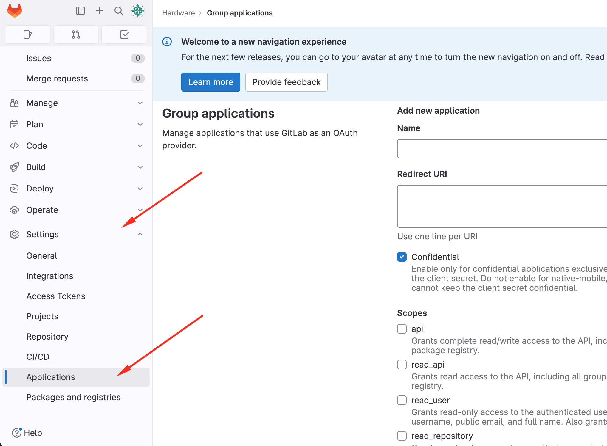

# Docker swarm stack for a self-hosted installation of CADLAB.io

This project provides Docker compose files and directory structure to run a self-hosted version of [CADLAB.io](https://cadlab.io).

## Support

For support inquiries, please visit https://cadlab.io/contact-us or email us at info@cadlab.io.

**Table of contents**

- [Docker swarm stack for a self-hosted installation of CADLAB.io](#docker-swarm-stack-for-a-self-hosted-installation-of-cadlabio)
  - [Support](#support)
  - [About CADLAB.io](#about-cadlabio)
  - [Installation](#installation)
    - [System requirements](#system-requirements)
    - [Install Docker](#install-docker)
    - [Move sshd to another port (stand-alone installation only)](#move-sshd-to-another-port-stand-alone-installation-only)
    - [SELinux Policies](#selinux-policies)
    - [Login into docker.cadlab.io](#login-into-dockercadlabio)
    - [Add DNS records](#add-dns-records)
    - [Install git](#install-git)
    - [Get CADLAB swarm stack compose file](#get-cadlab-swarm-stack-compose-file)
    - [Init swarm](#init-swarm)
    - [Create secrets](#create-secrets)
    - [Configure CADLAB](#configure-cadlab)
      - [hostname](#hostname)
      - [backups](#backups)
      - [ssl\_tls\_support](#ssl_tls_support)
      - [mail](#mail)
      - [reverse\_proxy](#reverse_proxy)
      - [Render memory limit](#render-memory-limit)
    - [Add license file](#add-license-file)
    - [Start CADLAB swarm](#start-cadlab-swarm)
    - [Checking services status](#checking-services-status)
  - [Troubleshooting](#troubleshooting)
    - [Checking container health](#checking-container-health)
    - [502 bad gateway](#502-bad-gateway)
  - [Changing CADLAB configurations](#changing-cadlab-configurations)
  - [Updating CADLAB](#updating-cadlab)
  - [Backup \& restore CADLAB](#backup--restore-cadlab)
    - [Backing up CADLAB](#backing-up-cadlab)
    - [Restoring CADLAB](#restoring-cadlab)
  - [CADLAB command-line utility](#cadlab-command-line-utility)
    - [Getting the DKIM configuration](#getting-the-dkim-configuration)
  - [Integrating CADLAB with external Git provider](#integrating-cadlab-with-external-git-provider)
    - [GitLab Integration](#gitlab-integration)
  - [Self-hosted GitLab](#self-hosted-gitlab)
    - [System-Level Application (Requires Admin Access)](#system-level-application-requires-admin-access)
    - [Group-Level Application (No Admin Access Required)](#group-level-application-no-admin-access-required)
  - [Cloud GitLab (gitlab.com)](#cloud-gitlab-gitlabcom)
    - [GitHub Integration](#github-integration)
  - [Creating a GitHub App](#creating-a-github-app)
    - [BitBucket Integration](#bitbucket-integration)
  - [BitBucket Cloud (bitbucket.org)](#bitbucket-cloud-bitbucketorg)
  - [BitBucket Data Center](#bitbucket-data-center)
  - [Links](#links)


## About CADLAB.io

[CADLAB.io](https://cadlab.io) is a git-based visual version control platform for collaborative PCB design. What makes CADLAB different from platforms like GitHub, GitLab, BitBucket, and other software-oriented platforms is that CADLAB is hardware-focused. It supports popular PCB design vendors like Altium, Autodesk Eagle, and KiCad. CADLAB works with native design files and renders schematics and PCB layouts right in a browser - no need to export, import, or install anything. Commit your design files to a repository, and you're ready. One of the most powerful CADLAB features is interactive visual diff for schematics and PCBs. You can compare any two revisions of your design and see what exactly was changed from one version to another. Together with the annotation feature, it enables hardware engineers to build a truly collaborative design process. Quality control and peer-review of design haven't been easier. You can find more information on our website https://cadlab.io.

CADLAB offers multiple options for where you can store your files. Like every other version control platform, CADLAB provides cloud-based repository hosting. It's free for open-source projects, and there are free repositories for individuals. If you are already using GitHub or GitLab (including self-hosted), you can easily connect CADLAB to your existing projects so that you can continue keeping your files on those platforms but can leverage CADLAB's graphical layer. Finally, for organizations that can't keep their files elsewhere but on their own server/network, there is a self-hosted version of CADLAB. You can deploy CADLAB to your own server as a stand-alone application or connected with a self-hosted GitLab. This project is meant to simplify the deployment process and provide you with pre-configured compose files to run CADLAB in a docker swarm. If you're not familiar with Docker, no worries. This documentation will provide you with a step-by-step guide on how to get it up and running.

If you're interested in running a self-hosted CADLAB instance, please contact our [sales](https://cadlab.io/quote).

## Installation

### System requirements

You can run CADLAB on a VPS or dedicated server. Below are recommended system requirements for a stand-alone installation of CADLAB and integration with GitLab.

**Stand-alone CADLAB installation:**
- 4+ CPU cores
- 8+ GB of RAM
- 40+ GB of storage
- Ubuntu/Debian/CentOS/Fedora operating system

**CADLAB integrated with a self-hosted GitLab:**
- 2-4+ CPU cores
- 4+ GB of RAM
- 20+ GB of storage
- Ubuntu/Debian/CentOS/Fedora operating system

**IMPORTANT:** There should be no other software on the server listening on ports 80, 443, and 22, as the Nginx container needs to use these ports for CADLAB to function properly.

### Install Docker

Install the latest release of Docker following the official [instructions](https://docs.docker.com/engine/install/#server).

Run the following command to make sure Docker was installed correctly:  

```bash
docker version
```

The output of this command should be somewhat like this:  


### Move sshd to another port (stand-alone installation only)

**Important**: This section is required only for the stand-alone CADLAB installation. If you install CADLAB with an external git back-end like GitLab, you should skip this section.

If you install CADLAB as a stand-alone application, it starts with a built-in git server that requires an SSH connection to interact with git repositories. Docker will proxy all SSH connections to the git container, making it impossible to connect to the host machine via SSH. We recommend moving the sshd server to another port to fix this issue, for example, 2222. To do this, you need to edit the sshd_config file.

SSH into your server and edit the following file `/etc/ssh/sshd_config` using `vi` or `nano` editor.

Somewhere close to the top of the file, you should see the following section:

```bash
# The strategy used for options in the default sshd_config shipped with
# OpenSSH is to specify options with their default value where
# possible, but leave them commented. Uncommented options override the
# default value.

Include /etc/ssh/sshd_config.d/*.conf

#Port 22
#AddressFamily any
#ListenAddress 0.0.0.0
#ListenAddress ::
```

Uncomment the line `#Port 22` by removing the pound sign `#` and change `22` to `2222`. 

### SELinux Policies
If you're using SELinux, it might be blocking SSHD from using non-standard ports. You can check this by running the command `semanage port -l | grep ssh`. If port `2222` is not listed, you can add it with the command `semanage port -a -t ssh_port_t -p tcp 2222`.

Now restart your sshd service by executing the following command:

```bash
service sshd restart
```

From now on, your sshd will be listening on port `2222`, and there will be no conflicts with Docker. To connect to your host machine, you will need to specify a port like so:

```bash
ssh -p 2222 YOUR_USER@YOUR_IP
```

### Login into docker.cadlab.io

To pull images from the CADLAB Docker registry, you need to log in using your Docker client and the credentials you obtain with a Self-Hosted CADLAB.io. Run the following command in the terminal:

```bash
docker login docker.cadlab.io
```

The system will ask you for a username/password, and after entering them, you should get a "Login Succeeded" message.

### Add DNS records

Add an A record for a domain/sub-domain you plan to use for CADLAB, for example:

```
cadlab.company.com
```

If you install CADLAB as a stand-alone application, you also need to create an A record for the git service. It has to be the same domain/subdomain as for the CADLAB app, but prepended with `git.` like so:

```
git.cadlab.company.com
```

Additionally, add or modify an SPF record and include the IP address of your CADLAB server. This step is needed for CADLAB to send emails. If you want CADLAB to send emails through your existing mail server, you can skip this step and specify a custom mail server in the cadlab.json file. 

Adding an SPF record depends on your domain registrar and is usually well-documented. But it all comes down to adding a TXT record with a value of the following format:

```
v=spf1 ip4:50.201.69.200 -all
```

**Important:** Keep in mind to replace *50.201.69.200* with your IP address. If your domain already has an SPF record, you should only include the 'ip4:50.201.69.200' part to add your new server.

DMARC and DKIM

To improve email deliverability, you may need DMARC and DKIM records. CADLAB is shipped with a DKIM signature functionality, that you can enable it using the [mail.dkim](#mail) setting and then use the command line utility to [get DNS config settings](#getting-the-dkim-configuration). To create a DKIM record you need to add a TXT record in your DNS manager. Below is an example of such record configured on GoDaddy:


To harden the email configuration, we also recommend configuring a DMARC record using the instructions form your DNS provider, or one of the guides available online.

### Install git

This is an optional step but makes the CADLAB update process more convenient. You can follow the official git installation instructions [here](https://git-scm.com/book/en/v2/Getting-Started-Installing-Git)

### Get CADLAB swarm stack compose file

Clone this repository to your server or download the latest release from the [releases page](https://github.com/CADLAB-io/CADLAB.io-swarm-stack/releases/) on GitHub if you don't want to use git.

Place the files in the `/var/cadlab`.

```bash
git clone https://github.com/CADLAB-io/CADLAB.io-swarm-stack.git /var/cadlab
```

### Init swarm

The CADLAB application should be launched in a Docker swarm for better stability and security. To activate swarm mode, run the following command:

```bash
docker swarm init
```

After running this command, you will see a message with a command you can use to add nodes to your swarm. Currently, CADLAB.io is supposed to be run on a single node, so you can ignore swarm join tokens. 

### Create secrets

Docker swarm provides a secure mechanism for managing secrets, e.g., passwords or other sensitive information. We will use secrets to create a database password. Below, we explain how to create a secret using a text file or input redirection.

The first option is to create a secret using a text file. To continue with this option, create a text file with your password using vim or nano editor. Here is an example of how to do it with vim:

```bash
cd /var/cadlab
vi mysql_password.txt
```

Then press `i` to enter the editing mode and type your password. To save the file, press `Esc`, type `:wq`, and press `enter`.

Now we can create our Docker secret and delete the file with the password: 

```bash
docker secret create mysql_root_pass mysql_password.txt
rm mysql_password.txt
```

To create a secret using input redirection, you need to perform the following commands:

```bash
echo "your_secure_password" | docker secret create mysql_root_pass -
```

But after you create a secret using input redirection, we recommend cleaning up your history. This way, you can ensure your password is not saved in plain text anywhere on the machine.

To delete your command from the history, first run the following:

```bash
history
```

Locate your secret creation line in the list and use its line number to delete it from the history:

```bash
history -d <N>
```

### Configure CADLAB

In order to configure CADLAB, you need to edit the cadlab.json file, located in the `/var/cadlab/configs` directory. The settings file is in the JSON format, and the very minimum you need to specify is a hostname:

```javascript
{
  "hostname": "cadlab.example.com"
}
```

To further configure CADLAB, you can add additional settings to the file. Below is the full list of settings you can specify.

#### hostname
A fully qualified domain name that you plan to use to access CADLAB.

```javascript
{
  "hostname": "cadlab.example.com"
}
```

#### backups
This setting controls CADLAB backups. 

```javascript
{
  ...
  "backups": {
    "enabled": true,
    "schedule": "daily"
  }
  ...
}
```

Below is the list of all object properties with available values:
- **enabled** - Determines whether automatic backups are enabled. Default: false.
- **schedule** - Defines the backup schedule. Possible values: `daily`, `weekly`, `monthly`, `custom`.
- **schedule_cron** - Required if schedule is set to `custom`. Specifies the schedule using the standard [cron format](https://en.wikipedia.org/wiki/Cron).

By default backups are not enabled, set the `enabled` property to `true` to enable backups.

Backups are stored in the `/var/cadlab/backups` directory located in the swarm project. CADLAB will automatically rotate backups and keep 10 most recent backups.

#### ssl_tls_support
This setting controls if your CADLAB instance will be available over HTTP or HTTPS. If this setting is not added, then HTTPS is disabled by default. `ssl_tls_support` is an object of the following structure:

```javascript
{
    ...
    "ssl_tls_support": {
        "enabled": true,
        "vendor": "letsencrypt"
    }
    ...
}
```

Below is the list of all object properties with available values:
- **enabled** - `true` or `false` enables/disables HTTPS. **Important:** if CADLAB is behind a [reverse proxy](#reverse_proxy), you may leave HTTPS disabled and handle HTTPS connection in your reverse proxy. If you want to keep HTTPS communication between your reverse proxy and CADLAB, you must use an `external` SSL certificate that your host machine with reverse proxy trusts. You may also choose `self-signed`, but this will require adding a custom Certificate Authority (CA) generated by CADLAB to your host with reverse proxy.
- **vendor** - specifies what certificates to use. Possible values are:
  - `letsencrypt` - CADLAB will automatically generate free Let's Encrypt certificates. **IMPORTANT**: Let's Encrypt needs to be able to access your CADLAB installation to validate the certificates. If the server you install CADLAB on is not reachable from the internet, you need to choose the `external` or `self-signed option.
  - `self-signed` - CADLAB will generate a custom Certificate Authority (CA) and TLS certificates for your domain. The Certificate Authority certificate will be placed in the `certificates` directory of the swarm project. In order for your users to access the website, they will need to add the generated CA to their computers. The instructions on adding a custom CA depend on an operating system and are well covered on the internet.
  - `external` - specifies that external certificates will be used for CADLAB. If this option is selected, you need to place certificates in the pem format and corresponding keys in the `certificates` directory of the swarm project. If you install CADLAB as a stand-alone application, you need to provide two pairs of certificate/keys for the hostname you specified in the `hostname` setting and `git.[hostname]`. For example, `cadlab.example.com.pem` / `cadlab.example.com.key` and `git.cadlab.example.com.pem` / `git.cadlab.example.com.key`.
- **custom_ca_key** - custom Certificate Authority (CA) key. You should specify this property if you want CADLAB to generate self-signed keys using your own Certificate Authority. In this case you also need to specify `custom_ca_pem`. The value of this property should be the filename of a custom CA placed in the `certificates` directory.
- **custom_ca_pem** - custom Certificate Authority (CA) cert file in pem format. You should specify this property if you want CADLAB to generate `self-signed` keys using your own Certificate Authority. In this case you should also specify `custom_ca_key`. The value of this property should be the filename of a custom CA certificate placed in the `certificates` directory. You should also specify this property if you've chosen `external` in the vendor property and your certificates are signed with a custom CA.

#### mail
By default, CADLAB uses a built-in send-only mail server. For this mail server to deliver emails successfully, you need to add an SPF and optionally DMARC, and DKIM records as described in the [Add DNS records](#add-dns-records) section. If you prefer using your own mail server, you can provide SMTP connection info in this section. `mail` is an object of the following structure:

```javascript
{
    ...
    "mail": {
      "enabled": true,
      "smtp": {
          "host": "example-mail-server.com",
          "port": 25,
          "username": "account_name",
          "password": "account_password",
      },
      "dkim": {
        "enabled": true,
        "domain_key": "mail"
      }
    }
    ...
}
```

Below is the list of all object properties with available values:
- **enabled** - specifies whether emails should be sent. Default: true.
- **smtp.host** - hostname of your mail server.
- **smtp.port** - SMTP port. It depends on your mail server setup, but usually, 587 if an encrypted protocol is used, or 25 as the default SMTP port.
- **smtp.protocol** - (optional) encryption protocol. Skip this setting if your server doesn't require a secure connection. Possible values are:
  - `tls`
  - `ssl`
- **smtp.from** - email address to be used as a sender.
- **smtp.username** - username of the email account you are going to use to send emails through. This setting is required only if your SMTP server requires authentication.
- **smtp.password** - account password. This setting is required only if your SMTP server requires authentication.
- **dkim.enabled** - specifies whether emails should be signed with DKIM. Default: false. **Important:** This setting is not used if `smtp` is configured. When DKIM is enabled, CADLAB will generate a signature key, that needs to be used when configuring DNS. Use the command line tool to get the DKIM configuration record described [here](#getting-the-dkim-configuration).
- **dkim.domain_key** - domain_key to be used for signature. The DKIM DNS record should be created with this domain_key. Default: mail.

**Note:** Use the command line utility to [get the DKIM record configs](#getting-the-dkim-configuration).

#### reverse_proxy
CADLAB is deployed with its own Nginx container to handle incoming traffic for ports `80`, `443`, and, optionally, `22`. If you install CADLAB on a server with other software running on the same ports, you may want to use a reverse proxy to handle connections. This will require modifying `stack.yml` or `stack-external-git.yml` file, depending on whether you deploy CADLAB with git or connect it to GitLab.

To do so, you need to change port bindings in the Nginx service section to some other ports you want to use for CADLAB on your server. For example, `8080` instead of `80`, and `8443` instead of `433` like below:

```yaml
ports:
    - mode: host
      target: 22
      published: 22
      protocol: tcp
    - mode: host
      target: 80
      published: 8080
      protocol: tcp
    - mode: host
      target: 443
      published: 8443
      protocol: tcp
```

Then in your reverse proxy, redirect requests to the domain specified in `hostname` setting to the ports you specified in the stack file. In most cases, you would disable [ssl_tls_support](#ssl_tls_support) in CADLAB and proxy requests to port `80`, leaving  HTTPS handling for your reverse proxy. You may choose to use HTTPS connection for communication between your proxy and CADLAB for more information on this [read here](#ssl_tls_support).

In addition to configuring your proxy and changing the stack file, you also need to tell CADLAB it's behind a proxy. To do that, you need to add the following section to `cadlab.json` file:

```javascript
{
    ...
    "reverse_proxy": {
        "enabled": true,
        "protocol": "https"
    }
    ...
}
```

Below is the list of all object properties with available values:
- **enabled** - `true` or `false` - tells CADLAB if it's behind a reverse proxy.
- **protocol** - `http` or `https` - tells CADLAB which protocol is used to access CADLAB in the reverse proxy so that CADLAB can build correct links to pages and resource files like CSS and JS.

#### Render memory limit

You can specify the amount of memory CADLAB uses to render a PCB design or schematic. The default value is `1G`, which is sufficient for most designs. However, if CADLAB reports that it couldn't render a file due to memory limitations, you can increase this value.

```javascript
{
    ...
    "render": {
        "memory_limit": '2G',
    }
    ...
}
```

Possible values: a number followed by `M` (megabytes) or `G` (gigabytes)."

### Add license file

Put your `license.key` file into the `/var/cadlab/configs` directory of the swarm project. Do not modify or re-save the license file, as it will fail validation, and the license key will not be valid. 

You can copy the license file from your local machine to the server in multiple ways. For example, if you're on Mac or Linux, you can use the `scp` [command](http://www.hypexr.org/linux_scp_help.php) like so:

```
scp -P 2222 license.key YOUR_USER@YOUR_IP:/var/cadlab/configs
```
`-P` stands for the port. You will need to use this if you install CADLAB as a stand-alone application since CADLAB uses standard SSH port `22` to work with your git container. If you use an external git back-end like GitLab, you can omit this option.

On Windows you can use [PuTTY](https://www.chiark.greenend.org.uk/~sgtatham/putty/latest.html) or SFTP client like [FileZilla](https://filezilla-project.org/)

### Start CADLAB swarm

Now, you're all good to deploy your swarm stack. Depending on whether you want to deploy CADLAB as a stand-alone app or with an external git back-end, you need to execute a `docker stack deploy` command with a specific stack file.

To install a stand-alone version of CADLAB, you need to execute the following command in the `/var/cadlab` directory:

```bash
docker stack deploy --with-registry-auth -c stack.yml cadlab
```

To install CADLAB with an external git back-end, like GitLab, use this command: 

```bash
docker stack deploy --with-registry-auth -c stack-external-git.yml cadlab
```

Starting CADLAB for the first time will take quite some time, as Docker needs to download all the required images and perform the initial installation. 

The stand-alone version of CADLAB is currently running 5 services:
- cadlab
- git-server
- mail-server
- mysql
- nginx

If you run CADLAB with an external git back-end like GitLab, then the `git-server` service is not included, and you should have 4 services running.

### Checking services status

After starting your swarm, you need to ensure that all services started successfully. To do it, you can run the following Docker command:

```bash
docker stack ps cadlab
```

It should list all running or failed services in your CADLAB stack.


You can see that some containers are already running while others are preparing or starting. If everything is going well, you should see that all containers are running after some time.

You can also list all services by executing the following Docker command:

```bash
docker service ls
```

The output of this command will be similar to this one:


The healthy application state is when all services are running with `1/1` in the replicas column.

## Troubleshooting

### Checking container health
If not all of your services are running properly, you will see that in the output of the `docker stack ps cadlab` command or `docker service ls` command. Usually, a service won't start because of an incorrect `cadlab.json` file. For example, if you made a mistake in the `automatic_backups` setting, the output of the `ps` command would look like this:


On the screenshot above, we see that after the cadlab container failed, Docker tried to restart it 3 more times but couldn't do it. We also see that there was a non-zero exit from the container, so we need to inspect the logs to see what went wrong.

If you list all services, you will also notice that cadlab service has `0/0` in the replicas column, which means that the cadlab container is not running:


To inspect logs for a service, you need to perform the following command:

```bash
docker service logs cadlab_cadlab
```

The last argument in this command is the service name, which you can find from the `docker service ls` command. You can also add the `-f` flag to the logs command to view logs in real-time like so `docker service logs -f cadlab_cadlab` and exit logs by pressing `ctrl+c`.

Below is the log output for the failed cadlab container:


We can see that the `automatic_backups` setting was incorrectly configured in the cadlab.json file.

After fixing the mistake in the cadlab.json file, you need to restart your failed service. First, you need to delete the failed service(s), those with `0/0` replicas, by executing the following command:

```bash
docker service rm cadlab_cadlab
```
- where `cadlab_cadlab` is the name of the service. 

If you have more than one failed service, you can delete all of them individually or delete the whole stack like this:

```bash
docker stack rm cadlab
```

After you have fixed the cadlab.json file and removed all failed services, you need to redeploy your stack by executing the command from the [Start CADLAB swarm](#start-cadlab-swarm).

If any container doesn't start, you need to repeat the troubleshooting steps.

### 502 bad gateway
Sometimes, you can get a 502 bad gateway error when trying to access the website even though all docker services are running without errors. It usually happens when you try to access the website while CADLAB is still being installed. In this case, wait a minute or two and try refreshing your browser.

## Changing CADLAB configurations

Sometimes, you may need to change the CADLAB configuration after the app was successfully deployed. In order to do this, you need to modify the `cadlab.json` file and execute a reconfigure command for CADLAB.

After you have modified your `cadlab.json` file, execute the following command:

```bash
docker exec -it cadlab_cadlab.w1ju1zaqlrpg5rbiqr9engr9n.0foep2va9ua1adzori4kj2ksc cadlab reconfigure
```
**Note**: `cadlab_cadlab.w1ju1zaqlrpg5rbiqr9engr9n.0foep2va9ua1adzori4kj2ksc` part is a dynamically generated container name in a Docker swarm. But you don't need to type it manually. When you write the `exec` command, just type `docker exec -it cadlab_cadlab` and press `tab`. This will autocomplete the container name. After that, type the `cadlab` utility and CADLAB command to execute, in this case, `reconfigure`.

If autocomplete didn't work on your machine, you could use an alternative way to execute this command. First, list all containers by running the following command:

```bash
docker container ls
```


Then copy the container ID of the cadlab container and use this ID instead of the container name like this:

```bash
docker exec -it 6803aaa81bbf cadlab reconfigure
```

## Updating CADLAB

**Important:** Please [make a backup](#backing-up-cadlab) before updating your CADLAB installation. It will help restore your data if the update process does not go as planned.

When a new release of CADLAB is available, you need to pull changes from this repository if you use git or download a new release from the Releases page to the `/var/cadlab` directory.

Then, perform the same `docker stack deploy` command we've already covered in the [Start CADLAB swarm](#start-cadlab-swarm) section.


## Backup & restore CADLAB

### Backing up CADLAB
When you configure CADLAB, you can set the `automatic_backups` option in the `cadlab.json` file to make CADLAB perform backups on a regular basis. Read about this setting [here](#automatic_backups). CADLAB database, files, and git data (for stand-alone installation) will be automatically backed up and stored in the `/var/cadlab/backups` directory. CADLAB will store 10 of the most recent backup files. Backups are named using the following format `[current_timestamp]-yyyy-mm-dd_cadlab.tar.gz`.

You can also perform backups manually using the CADLAB command-line utility. In order to do this, we need to execute a command in the `cadlab` container. 

```bash
docker exec -it cadlab_cadlab.w1ju1zaqlrpg5rbiqr9engr9n.0foep2va9ua1adzori4kj2ksc cadlab backup
```
**Note**: `cadlab_cadlab.w1ju1zaqlrpg5rbiqr9engr9n.0foep2va9ua1adzori4kj2ksc` part is a dynamically generated container name in a Docker swarm. See the [Changing CADLAB configurations](#changing-cadlab-configurations) section for guidance on how to find out what your unique container name is.

Depending on your backup strategy, you can then copy backups to Amazon S3 or another server in your network.

### Restoring CADLAB

When you need to restore CADLAB data from a backup, you can do that using the CADLAB command-line utility. By default, CADLAB will restore the most recent backup from the `/var/cadlab/backups` directory. In order to do this, execute the following command:

```bash
docker exec -it cadlab_cadlab.w1ju1zaqlrpg5rbiqr9engr9n.0foep2va9ua1adzori4kj2ksc cadlab restore
```
**Note**: `cadlab_cadlab.w1ju1zaqlrpg5rbiqr9engr9n.0foep2va9ua1adzori4kj2ksc` part is a dynamically generated container name in a Docker swarm. See the [Changing CADLAB configurations](#changing-cadlab-configurations) section for guidance on how to find out what your unique container name is.

The command-line utility will tell you what backup it is going to restore and ask for your confirmation.

If you need to restore a specific backup, you can add a `--file=FILENAME` option to specify the filename of the backup you want to restore. Please note that this backup should be in the `/var/cadlab/backups` directory.

```bash
docker exec -it cadlab_cadlab.w1ju1zaqlrpg5rbiqr9engr9n.0foep2va9ua1adzori4kj2ksc cadlab restore --file=1602549045-2020-10-13_cadlab.tar.gz
```

## CADLAB command-line utility

CADLAB offers a command-line utility to help you manage your CADLAB installation. It currently allows you to clear the application cache, backup, restore, and reconfigure CADLAB. The utility executable is called `cadlab` and can be used from within the `cadlab` container. Run the following Docker command to view the command-line utility help output:

```bash
docker exec -it cadlab_cadlab.w1ju1zaqlrpg5rbiqr9engr9n.0foep2va9ua1adzori4kj2ksc cadlab
```
**Note**: `cadlab_cadlab.w1ju1zaqlrpg5rbiqr9engr9n.0foep2va9ua1adzori4kj2ksc` part is a dynamically generated container name in a Docker swarm. See the [Changing CADLAB configurations](#changing-cadlab-configurations) section for guidance on how to find out what is your unique container name.

To execute one of the commands, for example, `reconfigure`, run the following Docker command:

```bash
docker exec -it cadlab_cadlab.w1ju1zaqlrpg5rbiqr9engr9n.0foep2va9ua1adzori4kj2ksc cadlab reconfigure
```

### Getting the DKIM configuration
If DKIM is enabled in the [mail settings](#mail), you can get the DKIM configuration record using the following command:

```bash
docker exec -it cadlab_cadlab.w1ju1zaqlrpg5rbiqr9engr9n.0foep2va9ua1adzori4kj2ksc cadlab mail get-dkim
```

The output of the of the command will be similar to the below example:

```bash
mail._domainkey	IN	TXT	( "v=DKIM1; k=rsa; "
	  "p=SDFfMA0GCSqGSsdV3DQEBAQUASDF4CBiQKDgQC1smkBqNaahqvkJDY5OI/TcP8XSd/6obLgpO0qsduB4cHv8qbXDMSxx/jWSizytqE/g/p9KYN+hSbCdfa5WKRQqT8W8asdfVdcWr90igD5CxLQbKwr0Ju/Kp2C9/D8yyz9RPDJne/M1e5BVeND0uXnq8CV8bTMWsd23sDDG8rNBwIDAQAB" )  ; ----- DKIM key mail for example.com
```

To create a DKIM DNS record, use the domain key as the record name:
```bash
mail._domainkey
```
Use the key - the part after `p=` as the record value:

```bash
SDFfMA0GCSqGSsdV3DQEBAQUASDF4CBiQKDgQC1smkBqNaahqvkJDY5OI/TcP8XSd/6obLgpO0qsduB4cHv8qbXDMSxx/jWSizytqE/g/p9KYN+hSbCdfa5WKRQqT8W8asdfVdcWr90igD5CxLQbKwr0Ju/Kp2C9/D8yyz9RPDJne/M1e5BVeND0uXnq8CV8bTMWsd23sDDG8rNBwIDAQAB
```

Example using GoDaddy DNS manager:


## Integrating CADLAB with external Git provider

If you choose to install CADLAB with an external git back-end, for example, GitLab, GitHub, or BitBucket, you need to use the `stack-external-git.yml` file to [start the swarm](#start-cadlab-swarm). After the CADLAB application successfully starts, you need to integrate it with your Git provider.

Open the URL you specified in the `hostname` [here](#hostname) in your browser, and you should see a CADLAB welcome screen:


Next, choose your Git Provider, and enter the URL of your Git provider in the URL field. **Please note**: if your Git provider is deployed to a private network, CADLAB also needs to be deployed to the same network so that it's able to connect to the Git API.

### GitLab Integration

If you selected **"GitLab Self-hosted"** or **"GitLab Cloud (gitlab.com)"** in the first step and CADLAB successfully connected to your GitLab, the integration settings form will appear as shown below.

- **Copy the Callback URL** from the form and proceed to create an application in GitLab.

  

---

## Self-hosted GitLab

To connect CADLAB with your **self-hosted GitLab**, you need to create an application in GitLab. There are two ways to do this:

### System-Level Application (Requires Admin Access)

You can integrate CADLAB with GitLab at the **system level**, which requires **admin permissions**.

1. **Navigate to Applications**:
   - Open **GitLab Admin Area** (1).
   - In the left-hand navigation, select **"Applications"** (2).
   - Click **"New Application"**.

     

2. **Create the Application**:
   - **Application Name**: Enter a name (e.g., **"CADLAB"**) (1).
   - **Redirect URI**: Paste the **CADLAB Callback URL** (2).
   - **Permissions**: Check the **"api"** checkbox (3).
   - Click **"Submit"**.

3. **Copy the Application Credentials**:
   - GitLab will generate an **Application ID** and **Secret Key**.

     

4. **Enter Credentials in CADLAB**:
   - Copy the **Application ID** and **Secret Key** into the CADLAB integration form.

     

5. **Complete the Setup**:
   - Click **"Create"** in CADLAB.
   - You will be redirected to the **GitLab sign-in** screen.

     

6. **Admin Role Assignment**:
   - The **first user** that signs in during the initial setup will be **automatically assigned an Admin role**.

---

### Group-Level Application (No Admin Access Required)

Alternatively, you can integrate CADLAB at the **group level**, which **does not** require admin permissions.

1. **Navigate to Group Settings**:
   - Open **GitLab Group Settings**.

     

2. **Create a New Application**:
   - Follow the same steps as in the [System-Level Application](#system-level-application) section.

---

## Cloud GitLab (gitlab.com)

If you selected **"GitLab Cloud (gitlab.com)"**, you should create an application at the **group level**, following the steps in the [Group-Level Application](#group-level-application) section.


### GitHub Integration

The setup process for both **GitHub Enterprise** and **GitHub Cloud** is the same. After completing the first step, the integration settings form will appear, as shown in the screenshot below.  

- **Copy the Callback URL** from the form and proceed to create a GitHub application.

  

---

## Creating a GitHub App

You can create a **GitHub App** for either a **user** or an **organization** profile.

1. **Navigate to Developer Settings**:
   - Open **Settings** in your preferred account or organization.
   - Select **"GitHub Apps"** under the **Developer settings** menu.

     

2. **Create a new GitHub App**:
   - Click **"New GitHub App"**.
   - **App Name**: Choose a name (e.g., **"CADLAB"**).
   - **Homepage URL**: Enter the URL of your **CADLAB installation**.
   - **Callback URL**: Copy and paste the **Callback URL** from the CADLAB integration form.

     

3. **Configure the Webhook**:
   - Copy the **Webhook URL** from CADLAB.
   - Paste it into the **"Webhook URL"** field.

     

4. **Set Permissions**:
   - **Repository permissions**:
     - **Access: Read & Write** for:
       - Contents
       - Pull Requests
       - Webhooks
   - **Account permissions**:
     - **Access: Read-only** for:
       - Email addresses

     

5. **Subscribe to Events**:
   - Check the following event subscriptions:
     - **Create**
     - **Delete**
     - **Push**
     - **Repository**

     

6. **Choose Installation Scope**:
   - **Any account**: Allows multiple organizations or user accounts to connect CADLAB.
   - **Only on this account**: Restricts the app to the current account.

7. **Create the GitHub App**:
   - Click **"Create GitHub App"** to proceed.

8. **Copy the App Credentials**:
   - Copy the following values into the CADLAB integration form:
     - **Client ID**
     - **Public URL**
     - **Client Secret**
   - If needed, click **"Generate a new client secret"** to obtain a new secret.

     

9. **Finalize the Integration**:
   - Paste the copied values into the **CADLAB integration form**.
   - Complete the setup.

     

10. **Sign in with GitHub**:
    - After completing the integration, you can **sign in to the CADLAB dashboard** using your **GitHub account**.
    - The **first user** to sign in will be **automatically assigned the Admin role**.

### BitBucket Integration

To integrate CADLAB with either **BitBucket Cloud (bitbucket.org)** or a **self-hosted BitBucket Data Center**, you need to create an OAuth consumer on BitBucket. Follow the respective instructions below.

---

## BitBucket Cloud (bitbucket.org)

1. In the first step of the CADLAB integration, select **"BitBucket Cloud (bitbucket.org)"** and proceed to the next step.

   

2. Create an OAuth consumer in BitBucket:
   - Navigate to **Workspace settings**, as shown in the screenshot below.

     

   - In the settings, go to **OAuth consumers** and click **"Add consumer"**.

     

3. Fill in the required fields:
   - **Name**: Enter a name for the consumer.
   - **Callback URL**: Copy and paste the **CADLAB callback URL** from the integration form.

     

4. Configure permissions:
   - **Read**: Account, Workspace membership, Project
   - **Write**: Pull requests, Webhooks
   - **Admin**: Repositories

     

5. Save the OAuth consumer and copy the **Consumer Key** and **Secret** into the CADLAB integration form.

   

6. Complete the integration in CADLAB. You will be prompted to **log in with your BitBucket account**.  
   - The first user to sign in will be **automatically assigned the Admin role**.

---

## BitBucket Data Center

CADLAB integrates with BitBucket Data Center using OAuth. This requires creating an **Application Link** in the BitBucket admin panel.

1. In the first step of the CADLAB integration, select **"BitBucket Data Center"** and proceed.

   

2. Create an **Application Link** in BitBucket Data Center:
   - Navigate to the **Admin panel**, then select **"Application links"**.

     

   - Click **"Create link"**, then:
     - Set **Application type** to **External application**.
     - Set **Direction** to **Incoming**.

     

3. Configure the Application Link:
   - **Name**: Enter a name for the application.
   - **Redirect URL**: Copy and paste the **CADLAB Callback URL** from the integration form.
   - **Permissions**:
     - **Admin**: Projects (this will also select Repositories)
     - **Write**: Account

     

4. Save the application and proceed to the **Credentials** screen.
   - Copy the **Client ID** and **Client Secret** into the CADLAB integration form.

     

5. Complete the integration in CADLAB. You will be prompted to **log in with your BitBucket account**.  
   - The first user to sign in will be **automatically assigned the Admin role**.

## Links

[CADLAB.io](https://cadlab.io), [Support](https://cadlab.io/contact-us), [Features](https://cadlab.io/features), [Pricing](https://cadlab.io/pricing), [Open source hardware projects](https://cadlab.io/projects)